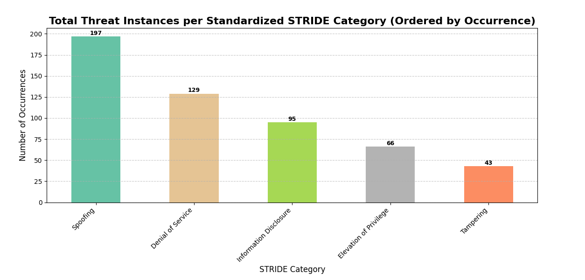
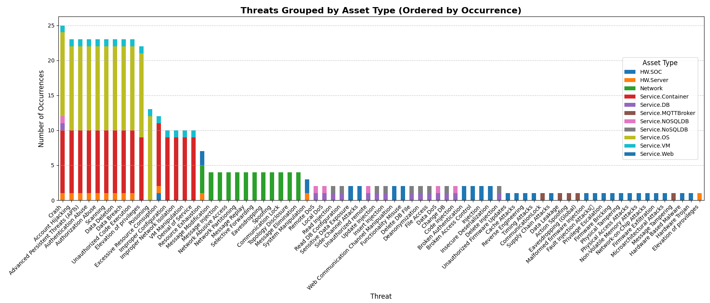
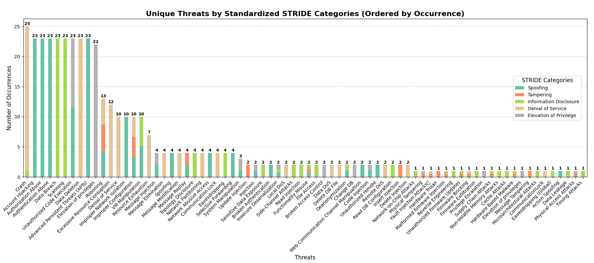

# On the Edge of Security: Threat-Driven Pentest of KubeEdge with ESSecA

This repository contains the resources for the peper "On the Edge of Security: Threat-Driven Pentest of KubeEdge with ESSecA".

## Authors
- [Felice Moretta](felice.moretta@unicampania.it)
- [Daniele Granata](daniele.granata@uniparthenope.it)
- [Massimiliano Rak](massimiliano.rak@unina.it)

## Abstract

The growing adoption of edge computing has introduced new architectural paradigms and increased complexity in IoT ecosystems. This shift, while beneficial in terms of latency, bandwidth, and resilience, also brings unresolved security challenges—particularly in platforms like KubeEdge, which extend Kubernetes functionalities to the edge. In this paper, we present a structured and automated security assessment of a real-world KubeEdge deployment by applying an expert system-based methodology (ESSecA). ESSecA adopts a threat-driven, model-based, and knowledge-supported approach to generate threat models, perform risk analysis, and plan penetration tests. We model the system using the MACM formalism, capturing both components and their interactions. The assessment reveals several security issues, especially concerning the MQTT-based communication between edge and IoT devices. We executed a set of penetration tests, including message tampering and unauthorized device control, exploiting insecure configurations in the MQTT broker. The identified vulnerabilities confirm the need for systematic security evaluations in edge environments. We propose countermeasures and outline future work aimed at enhancing the formal model to support dynamic system configurations and automated mitigation selection. To the best of our knowledge, there is no report in the literature regarding a comprehensive security assessment of a KubeEdge deployment. This work aims to fill that gap by providing the first such analysis.

## Contents
- [KubeEdge_MusicPlayer_QUATIC.macm](KubeEdge_MusicPlayer_QUATIC.macm): This file contains the formal model of the KubeEdge Music Player application, created using the MACM (Multi-purpose Application Composition Model) formalism. MACM utilizes the Cypher query language to describe the system, enabling comprehensive security analysis.
- [KubeEdge Player (QUATIC)_threat_model.xlsx](KubeEdge_Player_(QUATIC)_threat_model.xlsx): This spreadsheet documents the threat model developed during the threat modeling phase.
- [KubeEdge Player (QUATIC)_attack_plan-2.xlsx](KubeEdge_Player_(QUATIC)_attack_plan-2.xlsx): The attack plan used in the pentest.

## Testbed Configuration

The environment used for this case study reflects the official demo setup, available at [KubeEdge Pi-Player App Demo](https://github.com/kubeedge/examples/blob/master/web-demo/).

| Parameter                | Cloud Node          | Edge Node                                                                                             | Note |
| ------------------------ | ------------------- | ----------------------------------------------------------------------------------------------------- | ---- |
| Operating System         | Ubuntu 24.04.1 LTS  | Ubuntu 24.04.1 LTS                                                                                    | -    |
| Kubernetes Version       | v1.23.10            | -                                                                                                     | -    |
| KubeEdge Version         | v1.17.0             | v1.17.0                                                                                               | -    |
| Docker Version           | 24.0.6              | 27.5.1                                                                                                | -    |
| KubeSphere               | v3.4.1              | -                                                                                                     | -    |
| MQTT Broker (Mosquitto)  | -                   | v2.0.18                                                                                               | `anonymous-access` enabled, no TLS, no ACLs, manually installed, `externalMqttMode` mode |

## Threat Model Analytics

The following diagram illustrates the occurrences of threats for each STRIDE category in the KubeEdge Music Player application.

The following diagram provides a detailed view of the distribution of threats across the asset types in the KubeEdge Music Player application.

The following diagram shows the occurrences of threats in the KubeEdge Music Player application, categorized by the STRIDE model.

## Risk Analysis - Threat Agent Selection

### Threat Agent Questionnaire

1. Are there someone who can gain an advantage implementing a cyber threat against your system?
   - [x] Yes
   - [ ] No, the threats that apply to the system are related only to non-hostile situation
2. Do you trust all employees and do you assume that they are not a possible Threat agent?
   - [ ] Consider as "trusted" the employees
   - [x] Consider all threat agents
3. What are the goals of the attackers that represent the most threat to you?
   - [x] Make a replica of the asset so the agent has simultaneous access to it.
   - [x] Denial of the assets
   - [ ] The agent does not have a rational plan, or may make a choice opportunistically at the time of attack.
   - [ ] Destroy the asset, which becomes worthless to either Intel or the agent.
   - [ ] Damage the asset, which remains in owner's possession but has only limited functionality or value.
   - [x] Gain possession of the asset
4. What could be the expected results of a possible attacker in the phases of a possible attack on the software system?
   - [x] Theft
   - [x] Cause harm
   - [ ] Embarassment
   - [ ] Tech Advantage
   - [ ] Business Advantage

### Threat Agent Results

#### Cyber Vandal

| Field                          | Value                                                                 |
|-------------------------------|-----------------------------------------------------------------------|
| **Description**               | Derives thrills from intrusion or destruction of property, without strong agenda |
| **Threat Agent Common Actions** | Network/computing disruption, web hijacking, malware                   |
| **Intent**                    | Hostile                                                               |
| **Access**                    | External                                                              |
| **Visibility**                | Covert                                                                |
| **Resources**                 | Contest                                                               |
| **Skills**                    | Operational                                                           |
| **Limits**                    | Extra-legal minor                                                     |
| **Objectives**                | All                                                                   |
| **Outcome**                   | DamageOutcome                                                         |
| **Category Rating**           | **Low**                                                               |

---

#### Thief

| Field                          | Value                                                                 |
|-------------------------------|-----------------------------------------------------------------------|
| **Description**               | Opportunistic individual with simple profit motive                    |
| **Threat Agent Common Actions** | Theft of hardware goods or IP, PII, or business data                  |
| **Intent**                    | Hostile                                                               |
| **Access**                    | Internal                                                              |
| **Visibility**                | Clandestine                                                           |
| **Resources**                 | Individual                                                            |
| **Skills**                    | nan                                                                   |
| **Limits**                    | Extra-legal minor                                                     |
| **Objectives**                | Take                                                                  |
| **Outcome**                   | Acquisition/Theft                                                     |
| **Category Rating**           | **High**                                                              |

---

#### Government Cyberwarrior

| Field                          | Value                                                                 |
|-------------------------------|-----------------------------------------------------------------------|
| **Description**               | State-sponsored attacker with significant resources to affect major disruption on national scale |
| **Threat Agent Common Actions** | Organizational, infrastructural, and physical business disruption via network/computing disruption, web hijacking, malware |
| **Intent**                    | Hostile                                                               |
| **Access**                    | External                                                              |
| **Visibility**                | Multiple                                                              |
| **Resources**                 | Government                                                            |
| **Skills**                    | Adept                                                                 |
| **Limits**                    | Extra-legal major                                                     |
| **Objectives**                | Destroy, Damage                                                       |
| **Outcome**                   | DamageOutcome, Embarassment                                           |
| **Category Rating**           | **Medium**                                                            |

---

#### Sensationalist

| Field                          | Value                                                                 |
|-------------------------------|-----------------------------------------------------------------------|
| **Description**               | Attention-grabber who may employ any method for notoriety             |
| **Threat Agent Common Actions** | Public announcements for PR crises, theft of business data           |
| **Intent**                    | Hostile                                                               |
| **Access**                    | External                                                              |
| **Visibility**                | Overt                                                                 |
| **Resources**                 | Club                                                                  |
| **Skills**                    | Minimal                                                               |
| **Limits**                    | Extra-legal minor                                                     |
| **Objectives**                | All                                                                   |
| **Outcome**                   | DamageOutcome, Embarassment                                           |
| **Category Rating**           | **Low**                                                               |

---

#### Internal Spy

| Field                          | Value                                                                 |
|-------------------------------|-----------------------------------------------------------------------|
| **Description**               | Professional data gatherer as a trusted insider                       |
| **Threat Agent Common Actions** | Theft of IP, PII, or business data                                   |
| **Intent**                    | Hostile                                                               |
| **Access**                    | External                                                              |
| **Visibility**                | Clandestine                                                           |
| **Resources**                 | Organization                                                          |
| **Skills**                    | Adept                                                                 |
| **Limits**                    | Extra-legal minor                                                     |
| **Objectives**                | Copy                                                                  |
| **Outcome**                   | Acquisition/Theft, Tech Advantage                                     |
| **Category Rating**           | **High**                                                              |

---

#### Terrorist

| Field                          | Value                                                                 |
|-------------------------------|-----------------------------------------------------------------------|
| **Description**               | Person who relies on the use of violence to support socio-political agenda |
| **Threat Agent Common Actions** | Violence, property destruction, physical business disruption         |
| **Intent**                    | Hostile                                                               |
| **Access**                    | External                                                              |
| **Visibility**                | Covert                                                                |
| **Resources**                 | Organization                                                          |
| **Skills**                    | Adept                                                                 |
| **Limits**                    | Extra-legal major                                                     |
| **Objectives**                | Destroy, Damage, Take                                                 |
| **Outcome**                   | DamageOutcome                                                         |
| **Category Rating**           | **Medium**                                                            |

---

#### Irrational Individual

| Field                          | Value                                                                 |
|-------------------------------|-----------------------------------------------------------------------|
| **Description**               | Someone with illogical purpose and irrational behavior                |
| **Threat Agent Common Actions** | Personal violence causing physical business disruption               |
| **Intent**                    | Hostile                                                               |
| **Access**                    | External                                                              |
| **Visibility**                | Multiple                                                              |
| **Resources**                 | Individual                                                            |
| **Skills**                    | nan                                                                   |
| **Limits**                    | Extra-legal major                                                     |
| **Objectives**                | All                                                                   |
| **Outcome**                   | DamageOutcome, Embarassment                                           |
| **Category Rating**           | **Low**                                                               |

---

#### Mobster

| Field                          | Value                                                                 |
|-------------------------------|-----------------------------------------------------------------------|
| **Description**               | Manager of organized crime group with significant resources           |
| **Threat Agent Common Actions** | Theft of IP, PII, or business data, violence                         |
| **Intent**                    | Hostile                                                               |
| **Access**                    | External                                                              |
| **Visibility**                | Covert                                                                |
| **Resources**                 | Organization                                                          |
| **Skills**                    | Adept                                                                 |
| **Limits**                    | Extra-legal major                                                     |
| **Objectives**                | Take                                                                  |
| **Outcome**                   | Acquisition/Theft                                                     |
| **Category Rating**           | **High**                                                              |